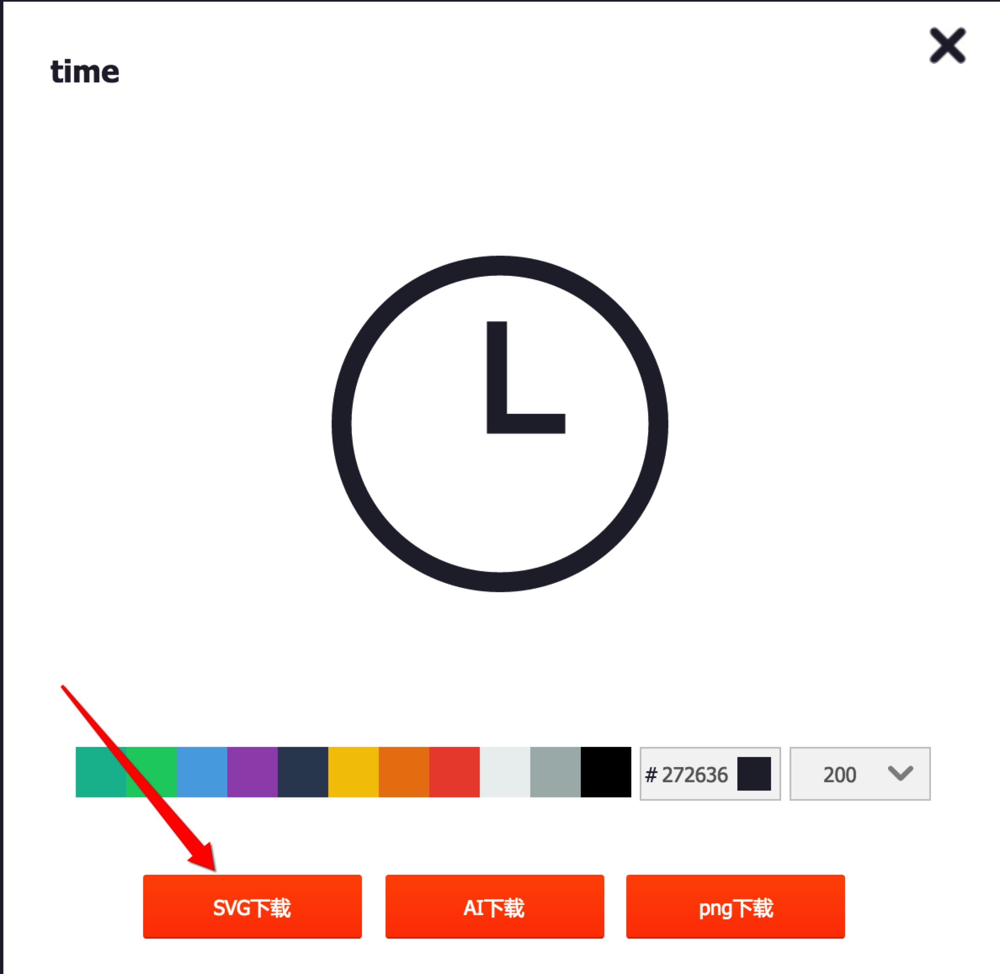

1、首先用npm安装好react-native-vector-icons，将node_modules/react-native-vector-icons的RNVectorIcons.xcodeproj文件拖到Xcode项目的Libraries中，然后在Xcode的Build Phase/Link Binary ...中添加libRNVectorIcons.a文件。 
 
  

2、接下来去http://www.iconfont.cn/plus 找你自己需要的矢量图标下载下来，如图： 
    

3、去https://icomoon.io 注册，然后将你下载的图标上传上去 
 
编辑一下图标的Scale和Aligment，scale设置为fit to canvas, Alignment设置为Align to center. 
 
点击页面右下角的Generat Font将图标Download下来。  

4、将下载下来的Icomoon.ttf文件拖到Xcode中，然后在info.plist文件添加相应的键值对。在node_modules/react-native-vector-icons下新建Icomoon.js文件，复制一份Icomoon.ttf到node_modules/react-native-vector-icons/Fonts目录下，node_modules/react-native-vector-icons/glyphmaps下新建Icomoon.json文件。.js文件和.json文件内容如下图: 
 
 
.json文件中的key自定随便，到时候使用的时候就用这个key，他的value从下载的字体文件夹中找到，也是一个json文件，打开后其中每一个对象有一个code键，它对应的value就是我们需要的那个值。 
  

5、接下来就可以使用了： 
  
效果如下： 
  